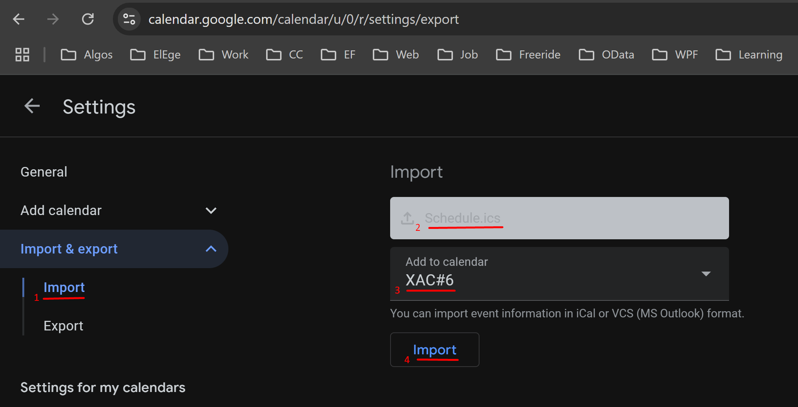

# Algo-calendar

Generates .ics file from yaml

1. Run generator
    ```shell
    ./CalendarGenerator.ps1 -InputFile ".\Schedule.yml"
    ```
2. Create new Google calendar.
3. Import `Schedule.yml` to newly created calendar.

